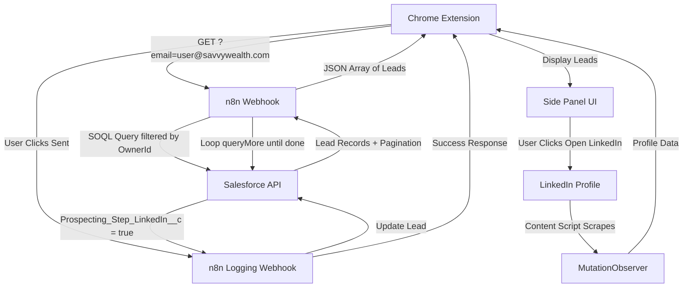

# SGA Velocity Sidebar v3.1

**High-velocity LinkedIn outreach tool for Savvy Wealth Strategic Growth Advisors**

[](package.json)
[](https://developer.chrome.com/docs/extensions/)
[](https://www.typescriptlang.org/)
[](https://developer.chrome.com/docs/extensions/mv3/intro/)

---

## 🎯 Overview

The **SGA Velocity Sidebar** is a Chrome Extension (Manifest V3) designed to dramatically accelerate LinkedIn outreach for Savvy Wealth's Strategic Growth Advisors (SGAs). This enterprise-grade tool seamlessly connects Salesforce lead data with LinkedIn profiles, enabling SGAs to touch 3-5x more leads per week while maintaining organization, compliance, and a human-in-the-loop approach that bypasses LinkedIn bot restrictions.

### The Problem It Solves

Traditional LinkedIn outreach workflows are slow and manual:
- **Context Switching**: Constantly switching between Salesforce and LinkedIn
- **Manual Data Entry**: Copying lead information manually between systems
- **Message Writing**: Writing personalized messages from scratch for each lead
- **Activity Tracking**: Losing track of who has been contacted and when
- **Bot Restrictions**: Risk of triggering LinkedIn's automated detection systems

### The Solution

A streamlined Chrome Extension that:
- ✅ Pulls leads directly from Salesforce lists with role-based access control
- ✅ Automatically navigates to LinkedIn profiles with one click
- ✅ Generates copy-paste ready, personalized messages using dynamic templates
- ✅ Logs activities back to Salesforce with one click
- ✅ Works within LinkedIn's restrictions (human-in-the-loop design)
- ✅ Supports custom message templates for A/B testing and personalization
- ✅ Handles Salesforce pagination automatically (unlimited lead counts)
- ✅ **The Flux Capacitor** ⚡ - Power-user mode for high-velocity outreach (88+ messages/hour)

---

## 🚀 Quick Start

Get up and running in 5 steps:

1. **Prerequisites**: Ensure you're signed into Chrome with an `@savvywealth.com` email
2. **Build**: Run `npm install && npm run build` in the project directory
3. **Load Extension**: Open `chrome://extensions/`, enable Developer mode, click "Load unpacked", select the `dist/` folder
4. **Configure Webhooks**: Open extension settings (⚙️), enter your n8n webhook URLs (for fetching leads and logging activities)
5. **Sync Leads**: Click "Sync from Salesforce" to load your assigned leads

> **Important**: See [Installation](#-installation) and [Configuration](#-configuration) sections for detailed setup instructions.

---

## ✨ Key Features

### 1. Direct Salesforce Integration

**Role-Based Access Control**
- **Admins**: See ALL leads across the organization
- **SGAs**: See only leads assigned to them (filtered via SOQL `OwnerId`)
- Automatic email domain validation (`@savvywealth.com` required)

**Pagination Support**
- Handles Salesforce's 2000-record limit automatically
- Loops through `queryMore` endpoint until all records are fetched
- No manual pagination required - works with lead lists of any size

**List Filtering**
- Filter by `Lead_List_Name__c` (assigned lists)
- Filter by `SGA_Self_List_name__c` (self-assigned lists)
- Fuzzy search for quick list navigation
- "Unsent Only" toggle to focus on new prospects

**Lead Fields Retrieved**
- **Core Fields**: `Id`, `FirstName`, `LastName`, `Company`, `Title`, `Status`
- **Custom Fields**: 
  - `Savvy_Lead_Score__c` - Lead quality score
  - `LinkedIn_Profile_Apollo__c` - LinkedIn profile URL
  - `Prospecting_Step_LinkedIn__c` - Message sent flag
  - `Lead_List_Name__c` - Assigned list name
  - `SGA_Self_List_name__c` - Self-assigned list name

### 2. LinkedIn Profile Navigation & Scraping

**Intelligent Profile Detection**
- Works on standard LinkedIn profile pages (`/in/`)
- Supports LinkedIn Talent Hub (`/talent/`)
- Supports LinkedIn Recruiter (`/recruiter/`)
- Automatic SPA navigation detection for React routing

**MutationObserver-Based Scraping**
- Waits for React hydration before scraping (not setTimeout-based)
- Reliable data extraction even on slow-loading pages
- Observes DOM mutations for dynamic content

**Data Extracted**
- Name (first, last, full)
- Job title and company
- Professional headline
- Location
- Accreditations (CFP®, CFA, CIMA®, etc.)
- Profile URL validation

### 3. Smart Message Generation

**System Default Templates**
- Pre-built templates for introductions, follow-ups, and reconnects
- Optimized for financial advisor outreach
- Read-only system templates (cannot be deleted)

**User Templates (Full CRUD)**
- Create, edit, delete, and duplicate custom templates
- Stored in `chrome.storage.sync` (syncs across Chrome profiles/devices)
- Organize by category: Intro, Follow-up, Reconnect, Custom
- Template management UI with inline editing

**Dynamic Variables**
Auto-populate messages with lead data:
- `{{firstName}}` - Lead's first name
- `{{lastName}}` - Lead's last name
- `{{fullName}}` - Combined first + last name
- `{{company}}` - Company/firm name
- `{{title}}` - Job title
- `{{location}}` - Geographic location
- `{{headline}}` - LinkedIn headline
- `{{accreditations}}` - Professional credentials (CFP®, CFA, etc.)
- `{{leadScore}}` - Savvy Lead Score value

**Template Features**
- Character count display
- Missing variable warnings
- Copy-to-clipboard with one click
- Template preview before generation

### 4. One-Click Activity Logging

**Salesforce Integration**
- Mark leads as "Sent" directly from the extension
- Automatically updates `Prospecting_Step_LinkedIn__c = true` in Salesforce
- Logs timestamp, SGA email, and action type
- Real-time sync with Salesforce records

**Activity Tracking**
- Visual indicators for sent vs. unsent leads
- "Unsent Only" filter to focus on new prospects
- Activity history maintained in Salesforce

### 5. Keyboard Shortcuts

Accelerate your workflow with keyboard shortcuts:

| Shortcut | Action | Notes |
|----------|--------|-------|
| `→` / `←` | Navigate to next/previous lead | With Flux Capacitor: also opens LinkedIn profile & auto-copies message |
| `⌘+S` / `Ctrl+S` | Mark current lead as sent | Only works when Flux Capacitor is enabled |
| `⌘+Enter` / `Ctrl+Enter` | Copy message to clipboard | When message input is focused |
| `Escape` | Close modals | Closes settings, template manager, or delete confirmation modals |

### 6. The Flux Capacitor ⚡ (Power-User Mode)

**High-Velocity Outreach Mode** - Transform your workflow into a hyper-efficient LinkedIn outreach machine.

**Enable in Settings** - Toggle "The Flux Capacitor" in the settings modal to activate power-user mode.

**When Enabled:**
- **Direct Navigation**: Arrow keys (← →) navigate directly to the lead's LinkedIn profile in the same window
- **Auto-Copy**: Message is automatically copied to clipboard when navigating to a lead
- **Same Window**: No new tabs - navigation happens in the current browser window
- **Quick Mark Sent**: `Ctrl+S` / `Cmd+S` hotkey marks the current lead as sent (works even when typing in inputs)
- **Visual Indicator**: ⚡ FLUX badge appears in the header when active

**Smart UX Integration:**
- Auto-Advance is automatically disabled when Flux Capacitor is enabled (prevents double navigation)
- Maintains manual control over when to move to the next lead
- Perfect for high-volume outreach sessions

**Why "Flux Capacitor"?** Because once you hit 88 messages per hour, you're going to see some serious velocity.

### 7. Human-in-the-Loop Design

**LinkedIn Compliance**
- You control every message before sending
- Copy-paste workflow (not automated sending)
- Bypasses LinkedIn bot restrictions
- Maintains authentic, personal outreach

**Workflow Control**
- Review and customize messages before sending
- Optional auto-advance to next lead after marking sent
- Full control over message timing and content

---

## 📋 Complete Workflow

### Step-by-Step User Journey

```
┌─────────────────────────────────────────────────────────────────┐
│                    SGA VELOCITY SIDEBAR WORKFLOW                │
└─────────────────────────────────────────────────────────────────┘

1. SGA opens extension
   ↓
   [Chrome Identity API reads profile email]
   ↓
2. Extension authenticates via @savvywealth.com email
   ↓
   [GET request to n8n webhook with email parameter]
   ↓
3. n8n workflow queries Salesforce
   ↓
   [SOQL filtered by OwnerId + pagination loop]
   ↓
4. Salesforce returns lead records (all pages)
   ↓
   [n8n formats and returns JSON array]
   ↓
5. Extension displays leads in sidebar
   ↓
   [SGA selects a lead from the list]
   ↓
6. Extension shows lead details (name, company, title, score)
   ↓
   [SGA clicks "Open LinkedIn" button]
   ↓
7. Extension navigates to LinkedIn profile
   ↓
   [Content script scrapes profile data via MutationObserver]
   ↓
8. LinkedIn data enriches lead (headline, location, accreditations)
   ↓
   [SGA selects message template from dropdown]
   ↓
9. Extension generates message with dynamic variables
   ↓
   [SGA reviews and customizes message if needed]
   ↓
10. SGA copies message → Pastes into LinkedIn message → Sends
    ↓
    [SGA clicks "✓ Sent" button]
    ↓
11. Extension sends POST to n8n logging webhook
    ↓
    [n8n updates Salesforce: Prospecting_Step_LinkedIn__c = true]
    ↓
12. Lead marked as sent in extension UI
    ↓
    [Optional: Auto-advance to next lead]
    ↓
13. Repeat for next lead
```

### Integration with SGA Command Center

After initial LinkedIn outreach via this extension, SGAs can continue the sequence in the **SGA Command Center**:

1. **LinkedIn Message** (via this extension) ✅
2. **SMS Messages** (via SGA Command Center)
3. **Email Campaigns** (via SGA Command Center)
4. **Voicemail Drops** (via SGA Command Center)

All activities are logged directly in Salesforce, providing:
- Complete activity history per lead
- Clear visibility of touchpoints
- Better organization and follow-up
- Increased activity per lead
- More leads touched per week

---

## 💡 Benefits

### For SGAs

- **Speed**: Touch 3-5x more leads per week (up to 88+ messages per hour with Flux Capacitor ⚡)
- **Organization**: Never lose track of who you've contacted
- **Personalization**: Messages automatically customized with lead data
- **Flexibility**: Create and test different message templates
- **Efficiency**: No more switching between multiple tools
- **Power-User Mode**: Flux Capacitor enables hyper-efficient workflows for high-volume outreach
- **Compliance**: All activities logged in Salesforce automatically

### For Savvy Wealth

- **Increased Activity**: More touches per lead = higher conversion rates
- **Better Data**: Complete activity tracking in Salesforce
- **Scalability**: SGAs can handle larger lead lists
- **Consistency**: Standardized outreach process
- **Analytics**: Better data for measuring outreach effectiveness

---

## 🛠️ Installation

### Prerequisites

- **Google Chrome** browser (latest version recommended)
- **Chrome profile** signed in with `@savvywealth.com` email address
- **n8n workflows** configured (see [n8n Setup](#n8n-webhook-setup))
- **n8n logging webhook** configured (see [n8n Logging Setup](#n8n-logging-webhook-setup))
- **Salesforce leads** assigned to your user account
- **Node.js** (v16 or higher) and npm (for building from source)

### Build from Source

```bash
# Clone the repository
git clone https://github.com/russellmoss/velocity-sidebar.git
cd velocity-sidebar

# Install dependencies
npm install

# Build the extension
npm run build

# The built extension will be in the `dist/` folder
```

### Load in Chrome

1. Open Chrome and navigate to `chrome://extensions/`
2. Enable **"Developer mode"** (toggle in top-right corner)
3. Click **"Load unpacked"**
4. Select the `dist/` folder from this project
5. The extension icon should appear in your Chrome toolbar

### Initial Setup

1. **Configure Webhooks** (one-time setup):
   - Click the extension icon in your Chrome toolbar
   - Click the settings icon (⚙️) in the extension footer
   - Enter your webhook URLs:
     - **Lead List Workflow URL**: Your n8n webhook URL for fetching leads
     - **Message Sent Logging URL**: Your n8n logging webhook URL for logging activities
   - Click **"Test Connection"** for each webhook to verify
   - Click **"Save Settings"**

2. **Sync Leads**:
   - Click **"Sync from Salesforce"** button in the extension
   - Leads will load automatically (may take a moment for large lists)

3. **Start Outreach**:
   - Select a lead from the list
   - Click **"Open LinkedIn"** to navigate to their profile
   - Select a message template
   - Copy and paste the generated message
   - Mark as **"Sent"** when done

---

## ⚙️ Configuration

### Settings

Access settings via the ⚙️ icon in the extension footer.

**Available Settings:**

| Setting | Description | Required |
|---------|-------------|----------|
| **Lead List Workflow URL** | n8n webhook URL for fetching leads from Salesforce | Yes |
| **Message Sent Logging URL** | n8n logging webhook URL for logging activities to Salesforce | Yes |
| **Auto-advance after marking sent** | Automatically move to next lead after marking current as sent | No |
| **The Flux Capacitor** | Power-user mode for high-velocity outreach (see [Flux Capacitor](#6-the-flux-capacitor--power-user-mode)) | No |

### n8n Webhook Setup

The n8n workflow handles **READING** Salesforce data and returns JSON arrays of lead records.

**Required Configuration:**
- **HTTP Method**: `GET`
- **Query Parameter**: `email` (SGA's email address)
- **Response Format**: JSON array of Lead records

**Detailed Setup Instructions:**
See [`documentation/N8N_COMPLETE_SETUP.md`](documentation/N8N_COMPLETE_SETUP.md) for complete n8n workflow configuration.

**Key n8n Workflow Features:**
- Role-based SOQL query filtering (`OwnerId` for SGAs, all leads for Admins)
- Automatic pagination handling (loops through `queryMore` endpoint)
- Returns all lead records regardless of count
- Extracts unique list names for frontend filtering

**Example n8n Webhook Request:**
```
GET https://your-n8n-instance.com/webhook/sga-leads?email=sga@savvywealth.com
```

**Example n8n Webhook Response:**
```json
[
  {
    "Id": "00Qxx000000xxxxx",
    "FirstName": "John",
    "LastName": "Doe",
    "Company": "ABC Financial",
    "Title": "Financial Advisor",
    "Savvy_Lead_Score__c": 85,
    "LinkedIn_Profile_Apollo__c": "https://linkedin.com/in/johndoe",
    "Status": "New",
    "Prospecting_Step_LinkedIn__c": false,
    "Lead_List_Name__c": "Q1 2024 Prospects",
    "SGA_Self_List_name__c": "High Priority"
  },
  ...
]
```

### n8n Logging Webhook Setup

The n8n logging webhook handles **WRITING** activity logs to Salesforce.

**Required Configuration:**
- **HTTP Method**: `POST`
- **Content-Type**: `application/json`
- **Action**: Update Salesforce Lead record

**Detailed Setup Instructions:**
See [`documentation/N8N_COMPLETE_SETUP.md`](documentation/N8N_COMPLETE_SETUP.md) for complete n8n workflow configuration.

**n8n Workflow Steps:**
1. **Webhook** - Receives POST request with activity data
2. **Salesforce** - Update Lead
   - Set `Prospecting_Step_LinkedIn__c = true`
   - Filter by Lead `Id`

**Example n8n Logging Webhook Request:**
```json
POST https://your-n8n-instance.com/webhook/log-activity

{
  "leadId": "00Qxx000000xxxxx",
  "sgaEmail": "sga@savvywealth.com",
  "timestamp": "2024-12-15T10:30:00Z",
  "action": "linkedin_sent"
}
```

**Example n8n Logging Webhook Response:**
```json
{
  "success": true,
  "leadId": "00Qxx000000xxxxx"
}
```

> **Important**: Both reading and writing operations use n8n workflows for consistency and superior JSON array handling capabilities.

---

## 📖 Usage Guide

### Basic Workflow

1. **Open Extension**: Click the extension icon in Chrome toolbar
2. **Sync Leads**: Click "Sync from Salesforce" (or auto-syncs on open)
3. **Filter Leads**: 
   - Use "List Filter" dropdown to select a specific list
   - Toggle "Unsent Only" to show only new leads
   - Use fuzzy search to quickly find lists
4. **Select Lead**: Click on a lead from the list
5. **View Details**: See lead information in the sidebar (name, company, title, lead score)
6. **Open LinkedIn**: Click "Open LinkedIn" button (or use arrow keys if Flux Capacitor is enabled)
7. **Generate Message**: 
   - Select a template from the dropdown
   - Message auto-populates with lead data
   - Customize if needed
8. **Copy Message**: Click "📋 Copy Message" button (or auto-copied if Flux Capacitor is enabled)
9. **Paste & Send**: Paste into LinkedIn message and send
10. **Mark Sent**: Click "✓ Sent" button (or press `Ctrl+S` / `Cmd+S` if Flux Capacitor is enabled)

### Flux Capacitor Workflow (Power-User Mode)

**Enable Flux Capacitor:**
1. Click the settings icon (⚙️) in the extension footer
2. Scroll to "The Flux Capacitor" section
3. Toggle the checkbox to enable
4. Click "Save Settings"
5. Look for the ⚡ FLUX badge in the header (confirms it's active)

**When Enabled**, the workflow becomes even faster:

1. **Navigate**: Press `→` (right arrow) to move to next lead
   - Automatically opens LinkedIn profile in same window
   - Message is auto-copied to clipboard
   - Toast notification confirms copy
2. **Review & Send**: Review the LinkedIn profile, paste message, and send
3. **Mark Sent**: Press `Ctrl+S` / `Cmd+S` to mark as sent (works even when typing)
4. **Repeat**: Press `→` again for the next lead

**Result**: Touch 3-5x more leads per hour with minimal friction!

**Note**: When Flux Capacitor is enabled, Auto-Advance is automatically disabled to prevent double navigation. You maintain full manual control over when to move to the next lead.

### Custom Templates

**Create Template:**
1. Click the gear icon (⚙️) next to template dropdown
2. Click "New Template" button
3. Enter template name, content, and category
4. Use variables: `{{firstName}}`, `{{company}}`, etc.
5. Click "Save"

**Edit Template:**
1. Click gear icon (⚙️) next to template dropdown
2. Click on template name in the list
3. Modify name, content, or category
4. Click "Save"

**Delete Template:**
1. Click gear icon (⚙️) next to template dropdown
2. Click trash icon (🗑️) next to template
3. Confirm deletion

**Duplicate Template:**
1. Click gear icon (⚙️) next to template dropdown
2. Click duplicate icon (📋) next to template
3. Edit the duplicated template as needed

**Template Categories:**
- **Intro**: First-time outreach messages
- **Follow-up**: Follow-up messages for previous contacts
- **Reconnect**: Reconnecting with past contacts
- **Custom**: Your own custom categories

### List Filtering

**Search Lists:**
- Type in the list filter dropdown to fuzzy search
- Matches list names containing your search term

**Filter Options:**
- **All Lists**: Select "All Lists" to see all leads
- **Specific List**: Select a list name to filter leads by `Lead_List_Name__c` or `SGA_Self_List_name__c`
- **Unsent Only**: Toggle to show only leads where `Prospecting_Step_LinkedIn__c = false`

**List Display:**
- Leads sorted alphabetically by last name
- Lead count shown in list filter dropdown
- Visual indicators for sent vs. unsent leads

### Keyboard Shortcuts

| Shortcut | Action | Description |
|----------|--------|-------------|
| `⌘+→` / `Ctrl+→` | Next Lead | Navigate to next lead in list |
| `⌘+←` / `Ctrl+←` | Previous Lead | Navigate to previous lead in list |
| `⌘+S` / `Ctrl+S` | Mark as Sent | Mark current lead as sent and log to Salesforce |
| `Escape` | Close Modal | Close template management or settings modal |

---

## 🏗️ Technical Architecture

### Data Flow



### Architecture Overview

**Backend Architecture:**
- **n8n**: Handles both READING and WRITING Salesforce data
- **Reading**: Fetches leads via GET webhook (returns JSON arrays)
- **Writing**: Logs activities via POST webhook (updates Salesforce records)
- **Rationale**: Consistent n8n-based architecture with superior JSON array handling

**Frontend:**
- **Chrome Extension (Manifest V3)**: Side panel UI, content scripts, service worker
- **TypeScript**: Type-safe JavaScript
- **Vite**: Fast build tool and dev server
- **Tailwind CSS**: Utility-first CSS framework

**Authentication:**
- **Method**: `chrome.identity.getProfileUserInfo` (NO OAuth required)
- **Process**: Reads Chrome profile email automatically
- **Validation**: Requires `@savvywealth.com` email domain
- **Security**: Email validated before API calls

**Storage Strategy:**
- **`chrome.storage.sync`**: User templates (syncs across Chrome profiles/devices)
- **`chrome.storage.local`**: Leads cache, API config, settings (local only)

**Salesforce Integration:**
- **Pagination**: Handles Salesforce's 2000-record limit via `queryMore` endpoint looping
- **Role-Based Access**: SOQL queries filtered by `OwnerId` for SGAs, all leads for Admins
- **Activity Logging**: Updates `Prospecting_Step_LinkedIn__c = true` when message is marked sent

**LinkedIn Scraper:**
- **Pattern**: MutationObserver (waits for React hydration, not setTimeout-based)
- **SPA Navigation**: Observes URL changes for React routing
- **Page Support**: Profile pages, Talent Hub, LinkedIn Recruiter

### Security Model

**Email-Based Authentication:**
- Uses Chrome's secure Identity API
- No OAuth tokens to manage
- Email validated before any API calls

**Role-Based Access Control:**
- Only shows leads assigned to the logged-in user (SOQL `OwnerId` filtering)
- Admins see all leads (configured in n8n workflow)
- Email domain validation (`@savvywealth.com` required)

**API Security:**
- All API calls go through n8n workflows with email validation
- Salesforce security enforced at database level (SOQL filtering)
- No sensitive data stored in extension (leads cached locally only)

**Data Privacy:**
- Leads cached locally only (not sent to external servers)
- User templates synced via Chrome's secure sync storage
- No tracking or analytics

### Pagination Handling

Salesforce limits SOQL queries to **2000 records** per request. The n8n workflow handles pagination automatically:

**Pagination Flow:**
1. Initial query returns first 2000 records
2. If `done: false`, `nextRecordsUrl` is present
3. Loop: Fetch next page using `queryMore` endpoint
4. Accumulate records across all pages
5. Continue until `done: true`
6. Return complete array of all records

**Example Pagination Response:**
```json
{
  "totalSize": 5432,
  "done": false,
  "nextRecordsUrl": "/services/data/v58.0/query/01gxx00000xxxxx-2000",
  "records": [...2000 records...]
}
```

The extension receives the complete array after all pages are fetched, so no client-side pagination is needed.

---

## 🐛 Troubleshooting

### No Leads Showing

**Possible Causes & Solutions:**

| Issue | Solution |
|-------|----------|
| Not signed into Chrome with `@savvywealth.com` email | Sign into Chrome with your Savvy Wealth account |
| Leads not assigned to you in Salesforce | Verify leads are assigned to your user account in Salesforce |
| n8n webhook URL not configured | Go to Settings (⚙️) and enter your n8n webhook URL |
| n8n workflow not active | Check n8n workflow is active and webhook is enabled |
| Leads don't meet criteria | Verify leads have `Status IN ('New', 'Contacting')` and `LinkedIn_Profile_Apollo__c != null` |
| Email domain validation failed | Ensure Chrome profile email ends with `@savvywealth.com` |

**Debug Steps:**
1. Open browser console (F12) and check for errors
2. Verify n8n webhook URL in Settings
3. Test n8n connection using "Test Connection" button
4. Check n8n workflow execution history
5. Verify Salesforce lead assignment

### Can't Open LinkedIn

**Possible Causes & Solutions:**

| Issue | Solution |
|-------|----------|
| LinkedIn URL missing in Salesforce | Verify `LinkedIn_Profile_Apollo__c` field is populated |
| LinkedIn URL invalid | Check URL format in Salesforce lead record |
| Extension not injected | Refresh LinkedIn page and try again |
| Content script error | Check browser console (F12) for errors |

**Debug Steps:**
1. Verify `LinkedIn_Profile_Apollo__c` field in Salesforce
2. Check browser console for content script errors
3. Refresh LinkedIn page
4. Try navigating to LinkedIn profile manually first

### Messages Not Generating

**Possible Causes & Solutions:**

| Issue | Solution |
|-------|----------|
| No template selected | Select a template from the dropdown |
| Lead data missing | Verify lead has required fields (FirstName, LastName, etc.) |
| Template variables don't match | Check template uses correct variable names (e.g., `{{firstName}}`) |
| LinkedIn data not scraped | Navigate to LinkedIn profile and wait for scraping to complete |

**Debug Steps:**
1. Select a template from dropdown
2. Verify lead data is populated in sidebar
3. Check template variable names match available data
4. Navigate to LinkedIn profile and wait for "Profile scraped" message

### Activities Not Logging

**Possible Causes & Solutions:**

| Issue | Solution |
|-------|----------|
| n8n logging webhook URL not configured | Go to Settings (⚙️) and enter your n8n logging webhook URL |
| n8n workflow not active | Check n8n workflow is active and webhook is enabled |
| Network error | Check browser console (F12) for network errors |
| Salesforce update failed | Check n8n workflow execution history for errors |

**Debug Steps:**
1. Verify n8n logging webhook URL in Settings
2. Test n8n logging connection using "Test Connection" button
3. Check browser console (F12) for network errors
4. Check n8n workflow execution history for failed updates
5. Verify Salesforce Lead `Id` is correct

### n8n Connection Errors

**Common Error Messages:**

| Error | Cause | Solution |
|-------|-------|----------|
| `n8n returned 404` | Webhook URL incorrect or workflow not active | Verify webhook URL and ensure workflow is active |
| `n8n returned 500` | n8n workflow error | Check n8n workflow execution logs |
| `n8n returned 400` | Invalid payload format | Check n8n webhook expects correct JSON structure |
| `Connection failed` | Network issue or webhook down | Verify webhook URLs are accessible |

**Debug Steps:**
1. Test webhook URLs directly in browser/Postman
2. Check n8n workflow execution history
3. Verify webhook authentication (if configured)
4. Check network connectivity

### Template Management Issues

**Possible Causes & Solutions:**

| Issue | Solution |
|-------|----------|
| Templates not syncing across devices | Templates use `chrome.storage.sync` - ensure Chrome sync is enabled |
| Template not saving | Check browser console for storage errors |
| Default templates reappearing | Default templates are system templates - you can hide them but not delete |

---

## 🔧 Development

### Project Structure

```
velocity-sidebar/
├── src/
│   ├── background/
│   │   └── service-worker.ts    # Message routing, side panel lifecycle
│   ├── content/
│   │   └── linkedin-scraper.ts  # DOM scraping with MutationObserver
│   ├── lib/
│   │   ├── api.ts               # n8n API integration (read & write)
│   │   ├── auth.ts              # chrome.identity.getProfileUserInfo
│   │   ├── storage.ts           # Chrome storage wrapper
│   │   └── templates.ts         # Message template processing
│   ├── sidepanel/
│   │   ├── index.html           # Side panel UI
│   │   ├── main.ts              # Application logic
│   │   └── styles.css           # Tailwind styles
│   └── types/
│       └── index.ts             # TypeScript interfaces (Salesforce schema)
├── public/
│   ├── icons/                   # Extension icons (16, 48, 128px)
│   └── manifest.json            # Manifest V3 configuration
├── documentation/               # Setup guides, workflow docs
├── scripts/                     # Build scripts (copy-manifest, generate-icons)
├── vite.config.ts               # Vite build configuration
├── tsconfig.json                # TypeScript configuration
├── tailwind.config.js           # Tailwind CSS configuration
└── package.json                 # Dependencies and scripts
```

### Development Commands

```bash
# Development mode (watch for changes)
npm run dev

# Build for production
npm run build

# Type checking (no emit)
npm run typecheck

# Clean build artifacts
npm run clean
```

### Tech Stack

| Technology | Purpose | Version |
|------------|---------|---------|
| **TypeScript** | Type-safe JavaScript | 5.3.3 |
| **Vite** | Build tool and dev server | 5.0.10 |
| **Tailwind CSS** | Utility-first CSS framework | 3.4.0 |
| **Chrome Extension APIs** | Identity, Storage, Side Panel, Scripting, Tabs, ClipboardWrite | Manifest V3 |

### Debugging

**Service Worker Logs:**
1. Open `chrome://extensions/`
2. Find "SGA Velocity Sidebar"
3. Click "service worker" link (under "Inspect views")
4. Check console for service worker logs

**Content Script Logs:**
1. Open LinkedIn profile page
2. Open browser console (F12)
3. Look for `[LinkedIn Scraper]` log messages

**Side Panel Logs:**
1. Open extension side panel
2. Open browser console (F12)
3. Check console for application logs

**Network Requests:**
1. Open browser DevTools (F12)
2. Go to Network tab
3. Filter by "Fetch/XHR"
4. Look for n8n webhook requests

### Testing Checklist

See [`documentation/TESTING_CHECKLIST.md`](documentation/TESTING_CHECKLIST.md) for complete testing procedures.

**Quick Test Checklist:**
- [ ] Extension loads without errors
- [ ] Authentication works (email detected)
- [ ] Leads sync from Salesforce
- [ ] LinkedIn profiles open correctly
- [ ] Profile data scrapes successfully
- [ ] Message templates generate correctly
- [ ] Activities log to Salesforce
- [ ] Custom templates save/load correctly
- [ ] Keyboard shortcuts work
- [ ] List filtering works

---

## 📚 API Reference

### n8n Webhook (GET) - Fetch Leads

**Endpoint:** `GET {n8n-webhook-url}?email={sga-email}`

**Request:**
```
GET https://your-n8n-instance.com/webhook/sga-leads?email=sga@savvywealth.com
```

**Response:**
```json
[
  {
    "Id": "00Qxx000000xxxxx",
    "FirstName": "John",
    "LastName": "Doe",
    "Company": "ABC Financial",
    "Title": "Financial Advisor",
    "Savvy_Lead_Score__c": 85,
    "LinkedIn_Profile_Apollo__c": "https://linkedin.com/in/johndoe",
    "Status": "New",
    "Prospecting_Step_LinkedIn__c": false,
    "DoNotCall": false,
    "Lead_List_Name__c": "Q1 2024 Prospects",
    "SGA_Self_List_name__c": "High Priority"
  }
]
```

**Error Response:**
```json
{
  "error": "Error message here"
}
```

### n8n Logging Webhook (POST) - Log Activity

**Endpoint:** `POST {n8n-logging-webhook-url}`

**Request:**
```json
{
  "leadId": "00Qxx000000xxxxx",
  "sgaEmail": "sga@savvywealth.com",
  "timestamp": "2024-12-15T10:30:00Z",
  "action": "linkedin_sent"
}
```

**Response:**
```json
{
  "success": true
}
```

**Error Response:**
```json
{
  "success": false,
  "error": "Error message here"
}
```

---

## 🔒 Security & Privacy

### Data Access

**What Data is Accessed:**
- Chrome profile email (via `chrome.identity.getProfileUserInfo`)
- Salesforce lead records (via n8n webhook)
- LinkedIn profile data (via content script scraping)

**What Data is Stored:**
- User email (cached locally for faster startup)
- Lead records (cached locally, not synced)
- User templates (synced via Chrome sync storage)
- API configuration (webhook URLs, stored locally)

**What Data is NOT Stored:**
- LinkedIn messages
- Salesforce passwords or tokens
- Personal browsing data
- Analytics or tracking data

### Privacy

- **No External Tracking**: Extension does not send data to analytics services
- **Local Storage Only**: Leads cached locally, not sent to external servers
- **Secure API Calls**: All API calls go through n8n workflows with email validation
- **Chrome Sync**: Only user templates sync across devices (via Chrome's secure sync)

### Security

- **Email Domain Validation**: Only `@savvywealth.com` emails allowed
- **Role-Based Access**: SOQL queries filtered by `OwnerId` at database level
- **No OAuth Tokens**: Uses Chrome Identity API (no token management)
- **Secure Storage**: Uses Chrome's secure storage APIs

---

## 📝 Changelog

### v3.1.0 (Current)

**New Features:**
- ✅ **The Flux Capacitor** ⚡ - Power-user mode for high-velocity outreach
  - Direct navigation to LinkedIn profiles via arrow keys
  - Auto-copy messages to clipboard on navigation
  - Same-window navigation (no new tabs)
  - Quick mark sent with `Ctrl+S` / `Cmd+S` hotkey
  - Visual indicator when active
- ✅ Support for `SGA_Self_List_name__c` field
- ✅ Custom user templates with full CRUD operations
- ✅ Fuzzy search for list filtering
- ✅ Alphabetical sorting of leads
- ✅ Enhanced security and email validation
- ✅ Improved UI/UX

**Improvements:**
- Better error handling for webhook connections
- Improved LinkedIn scraping reliability
- Enhanced template management UI
- Better keyboard shortcut support
- Smart UX integration: Auto-Advance automatically disabled when Flux Capacitor is enabled

### v3.0.0

**Initial Release:**
- Core functionality with Salesforce integration
- LinkedIn profile scraping
- Message template system
- Activity logging
- Role-based access control

---

## 📚 Documentation

Additional documentation is available in the `documentation/` folder:

| Document | Description |
|----------|-------------|
| [`N8N_COMPLETE_SETUP.md`](documentation/N8N_COMPLETE_SETUP.md) | Complete n8n workflow setup guide |
| [`N8N_WORKFLOW_CODE_COMPLETE.md`](documentation/N8N_WORKFLOW_CODE_COMPLETE.md) | Full n8n node code examples |
| [`N8N_SALESFORCE_NODE_CONFIG.md`](documentation/N8N_SALESFORCE_NODE_CONFIG.md) | Salesforce node configuration details |
| [`WEBHOOK_SETUP_GUIDE.md`](documentation/WEBHOOK_SETUP_GUIDE.md) | n8n webhook setup guide |
| [`SECURITY_LEAD_FILTERING.md`](documentation/SECURITY_LEAD_FILTERING.md) | Security and lead filtering details |
| [`custom_template_update.md`](documentation/custom_template_update.md) | Template management implementation |
| [`TESTING_CHECKLIST.md`](documentation/TESTING_CHECKLIST.md) | Complete testing procedures |
| [`TESTING_GUIDE.md`](documentation/TESTING_GUIDE.md) | Testing guide and best practices |
| [`BUILD_INSTRUCTIONS.md`](documentation/BUILD_INSTRUCTIONS.md) | Build and deployment instructions |
| [`flux_capacitor_implementation.md`](flux_capacitor_implementation.md) | Complete Flux Capacitor implementation guide |

---

## 🤝 Support

For issues, questions, or feature requests:

1. **Check Documentation**: Review the `documentation/` folder for setup guides
2. **Review Troubleshooting**: See [Troubleshooting](#-troubleshooting) section above
3. **Check Browser Console**: Open DevTools (F12) and check for errors
4. **Contact Admin**: Reach out to your Savvy Wealth admin for assistance

---

## 📄 License

Proprietary - Savvy Wealth Internal Use Only

---

## 🙏 Acknowledgments

Built for Savvy Wealth Strategic Growth Advisors to accelerate LinkedIn outreach and increase lead engagement.

**Version:** 3.1.0  
**Last Updated:** December 2024  
**Maintained by:** Savvy Wealth Development Team
